## Solution
提供一个11步的解法。
1. 第一步随便点。
2. 第二、三步下在以猫为中心，起点位置的对称点上。

    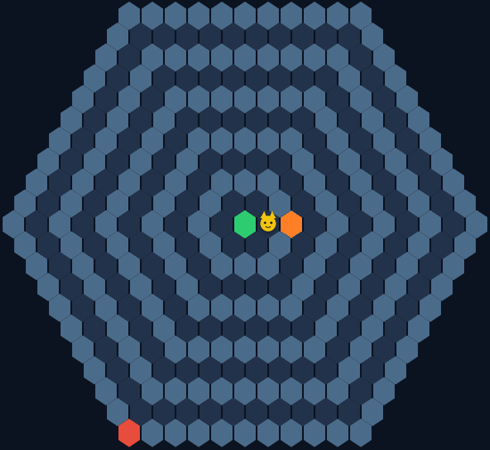
    &nbsp;
    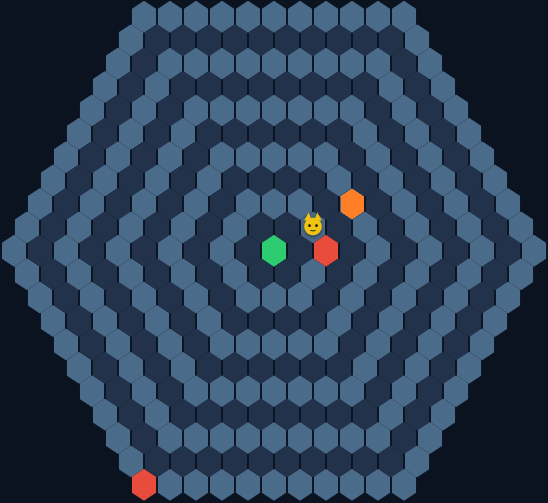

    之后小猫必定移动到我们第三步障碍格的相邻格子，如下图所示，它未来可能的移动区域是如图的黄色三角形。
    
    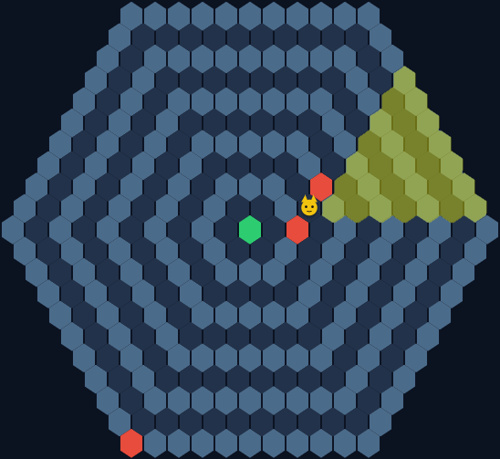
3. 第四、五步我们下在这个黄色三角形第四排的中间两个格子。这两个格子占完小猫只可能从第四排两边走，而我们下出第五步后小猫的移动会决定它走的是哪一边。

    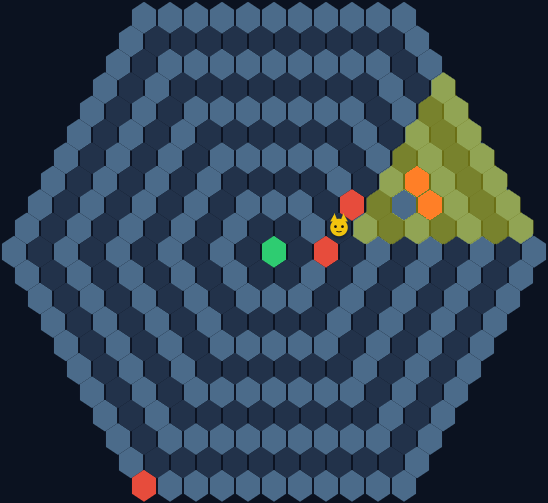
    &nbsp;
    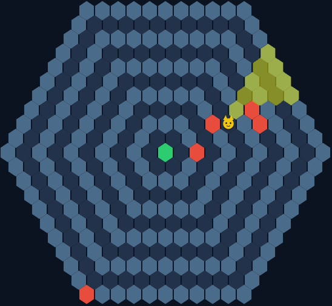

4. 最后只需要在小猫必定行进的路线上设置陷阱即可。但是要注意不要过早堵死小猫的行进路线。

    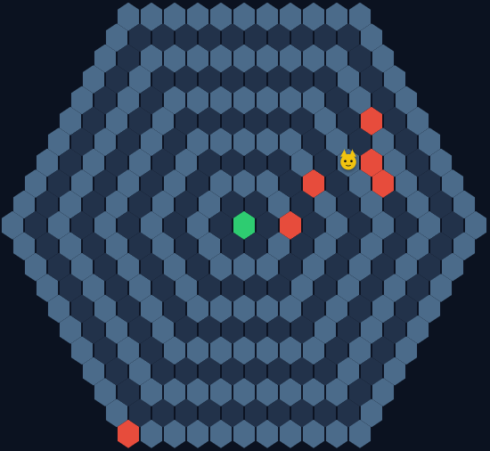
    &nbsp;
    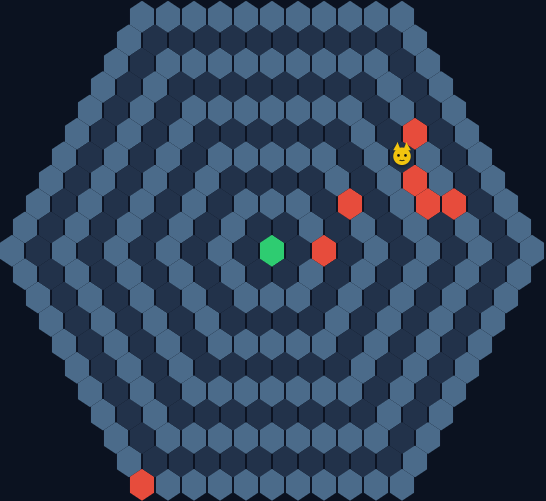
    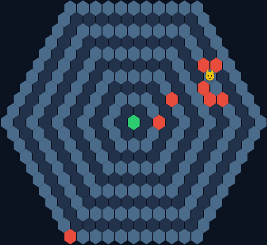
    &nbsp;
    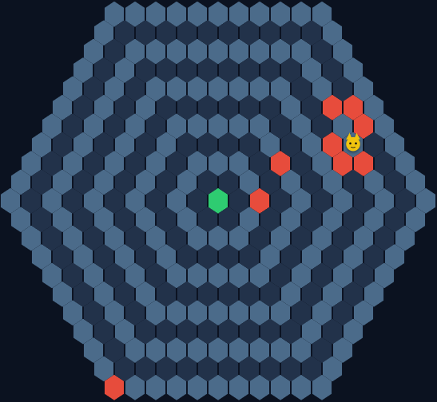
    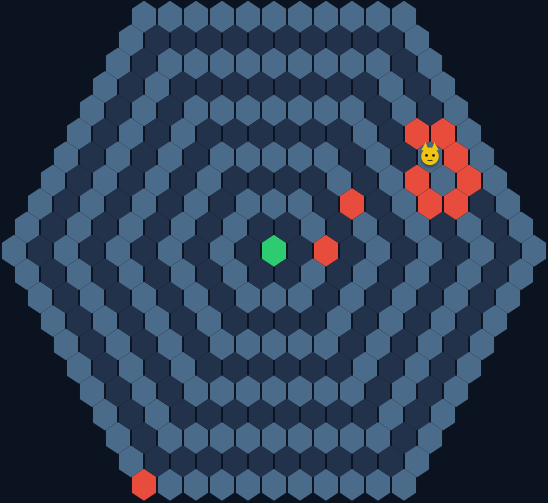
    &nbsp;
    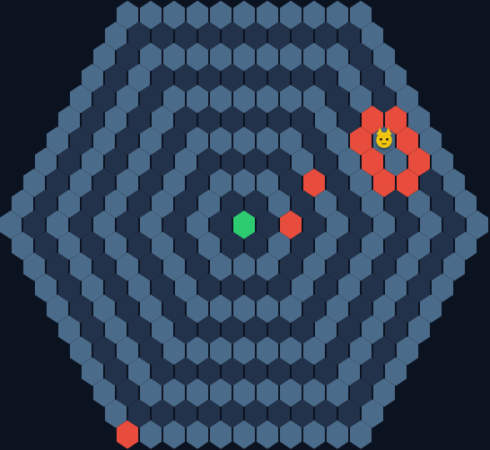